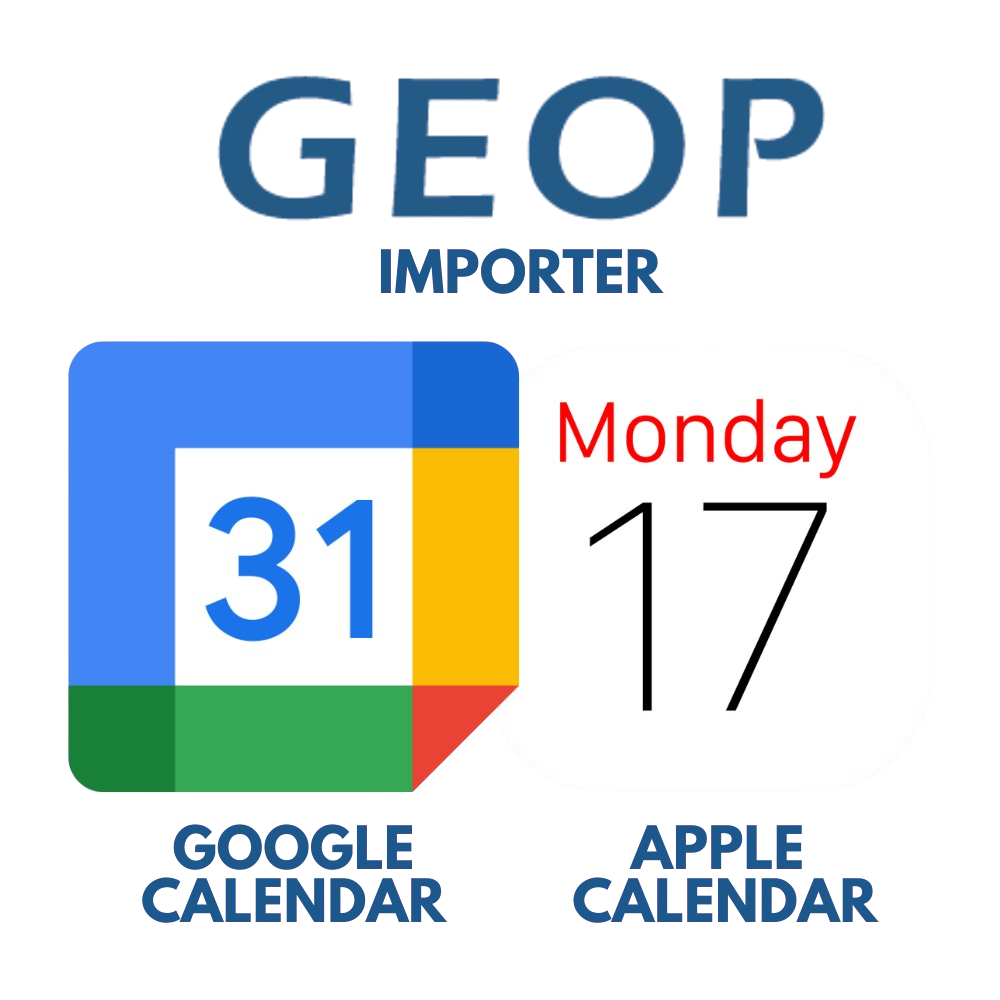

<p align="center">
  
</p>

# GEOP Importer (Google Calendar Sync)
<p align="center">
  
  
</p>

## ✨ Overview
Automates:
- extraction of lessons/exams from GEOP
- ICS export (`exportGEOP.ics`)
- synchronization to a dedicated Google Calendar (create / update / delete)

This project is designed to run on Windows and can auto-run at login.

## 🧭 Quick Navigation
- 🚀 Setup: sections 2-9
- 🔁 Auto-run at login: section 11
- 🛠 Troubleshooting: section 13
- 🔒 Security: section 14

## ⚙️ 1) What this script does

At each run:
1. Logs into GEOP with Selenium.
2. Reads weekly events until `END_DATE`.
3. Builds a normalized event list (title, start, end, location).
4. Exports an ICS file (`exportGEOP.ics`).
5. Syncs with Google Calendar:
- creates new events
- updates modified events
- deletes events removed from GEOP

## 📋 2) Prerequisites

- Windows 10/11
- Python 3.10+
- Google Chrome installed
- A Google account
- Access to your GEOP portal

## 📦 3) Clone and open project

```powershell
git clone https://github.com/alerizzidev/GeopImporter.git
cd GeopImporter
```

## 🧪 4) Create virtual environment

```powershell
python -m venv geop-env
.\geop-env\Scripts\activate
```

## 📥 5) Install dependencies

```powershell
pip install selenium webdriver-manager colorama google-api-python-client google-auth-httplib2 google-auth-oauthlib
```

## 🛠️ 6) Prepare script file

1. Rename `scriptexample.py` to `script.py`.
2. Open `script.py` and set:

```python
# GEOP
URL = "https://your-geop-domain.example/"
USERNAME = "YOUR_GEOP_USERNAME"
PASSWORD = "YOUR_GEOP_PASSWORD"
END_DATE = datetime(2026, 7, 31)

# Google Sync
GOOGLE_SYNC_ENABLED = True
GOOGLE_CALENDAR_ID = "YOUR_GOOGLE_CALENDAR_ID"
GOOGLE_CLIENT_SECRET_FILE = "google_client_secret.json"
GOOGLE_TOKEN_FILE = "google_token.json"
GOOGLE_STATE_FILE = "sync_state.json"
```

Notes:
- Use a **dedicated Google calendar** for this integration.
- Keep `GOOGLE_SYNC_ENABLED = True` for synchronization.
- As of today, `scriptexample.py` uses `END_DATE = datetime(2026, 7, 31)`.
- You can customize this date based on the length of your academic year.
- If GEOP schedule changes, set `END_DATE` to about **1 week after the last event visible on GEOP**.

## 🔐 7) Create Google OAuth credentials

In Google Cloud Console:
1. Create/select a project.
2. Enable **Google Calendar API**.
3. Configure OAuth consent screen.
4. Create OAuth client ID of type **Desktop app**.
5. Download the JSON credentials file.

Place that file in the project root as:
- `google_client_secret.json`

## 🆔 8) Find Google Calendar ID

In Google Calendar Web:
1. Settings
2. Select your dedicated calendar
3. "Integrate calendar"
4. Copy "Calendar ID"

Paste it into `GOOGLE_CALENDAR_ID` in `script.py`.

## ▶️ 9) First run (OAuth login)

```powershell
.\geop-env\Scripts\python.exe .\script.py
```

On first run:
- browser login/consent (when the scirpt finish) auto opens for Google OAuth
- `google_token.json` is created

After this, next runs reuse token automatically.

## 🗂️ 10) Output files (local only)

Generated at runtime:
- `exportGEOP.ics`
- `google_token.json`
- `sync_state.json`

Do not commit these files.

## 🔁 11) Auto-run at Windows login

Create file:
- `%APPDATA%\Microsoft\Windows\Start Menu\Programs\Startup\GEOP-Sync-Auto.cmd`

Content:

```bat
@echo off
cd /d C:\path\to\your\repo
C:\path\to\your\repo\geop-env\Scripts\python.exe C:\path\to\your\repo\script.py
```

Now synchronization starts every time you log in.

## 🔄 12) How updates are handled

Sync logic uses local `sync_state.json`:
- if event is new -> create on Google
- if event changed -> update on Google
- if event removed from GEOP -> delete on Google

This keeps Google Calendar aligned with GEOP changes.

## 🧯 13) Common issues and fixes

### No events found
- Check `URL`, `USERNAME`, `PASSWORD`
- Verify you are in the right GEOP calendar view
- Increase timeout if GEOP is slow

### OAuth not opening
- Check `google_client_secret.json` exists in project root
- Check Calendar API is enabled
- Delete invalid `google_token.json` and rerun

### Permission denied / API errors
- Ensure your Google user is allowed in OAuth test users
- Ensure `GOOGLE_CALENDAR_ID` belongs to your account or shared with write access

### Empty or outdated calendar
- Delete `sync_state.json` and rerun once to rebuild mapping

## 🔒 14) Security best practices

- Never commit personal credentials.
- Keep `google_client_secret.json`, `google_token.json`, and any personal files local-only.
- Rotate credentials immediately if exposed.

## ✅ 15) Recommended routine

1. Keep script configured once.
2. Let it auto-run at login.
3. Optionally run manually anytime for immediate refresh.
4. Use Google Calendar app on iPhone with the same account to see updates.

## ©️ 16) Copyright and attribution

Copyright (c) Alessandro Rizzi.

This project can be used, copied, and adapted by anyone for personal or educational use, but attribution must be preserved.
Do not remove the original author credit and do not present this project as your own original work.


